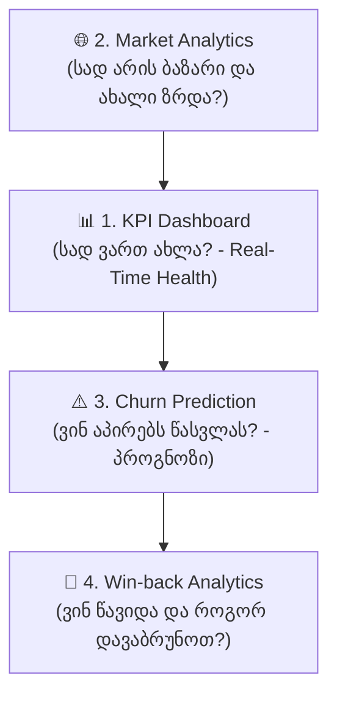

# 📊 SYSTEM RULE: ARTRON ADMIN PANEL ANALYTICAL MODULES GUIDE
## DIRECTIVE: FUNCTIONAL AND BUSINESS ARCHITECTURE OF THE 4 CORE ANALYTICAL MODULES

---

### 🗺️ ანალიტიკური ეკოსისტემის არქიტექტურა
მართვის პანელის (CRM) ანალიტიკური ბირთვი შედგება 4 ძირითადი მოდულისაგან: **Win-back Analytics**, **Market Analytics**, **Churn Prediction** და **KPI Dashboard**.

---

### 1. 🔄 Win-back Analytics (პასიური და წასული წევრების დაბრუნება)
* **მიზანი:** იმ წევრების იდენტიფიცირება და რეაქტივაცია, რომელთაც შეწყვიტეს დარბაზში სიარული ან რომელთა აბონემენტის ვადაც ამოიწურა.
* **ძირითადი შესაძლებლობები:**
  * **პასიურობის დონის სეგმენტაცია:**
    * *Fresh Lapsed (ახალი პასიურები):* 14–30 დღე Check-in-ის გარეშე.
    * *Medium Risk (საშუალო ვადა):* 30–60 დღე უაქტივო.
    * *Lost Customers (დაკარგულები):* 90+ დღე ვადაგასული.
  * **კამპანიების ეფექტურობის ანალიზი (Campaign ROI):** SMS/Push/Email შეთავაზებების ანალიტიკა (გაგზავნილი vs. დაბრუნებული). შეთავაზებების ტიპების ტესტირება (-15% ფასდაკლება vs. +7 დღე უფასოდ vs. უფასო პერსონალური ვარჯიში).
  * **Cost per Win-back vs. CAC:** ადარებს ძველი წევრის რეაქტივაციის ღირებულებას ახალი კლიენტის CAC-თან.
  * **მიზეზების ანალიტიკა (Reason for Leaving):** ფასი, სისუფთავე, გადატვირთულობა, მწვრთნელის ხარისხი, ლოკაცია.
* **💰 ბიზნეს ღირებულება (ROI):** ყოფილი კლიენტის დაბრუნება 5-7-ჯერ უფრო იაფია, ვიდრე ახლის მოზიდვა. მინიმალური დანახარჯით აბრუნებს დაკარგული წევრების 15–25%-ს.

---

### 2. 🌐 Market Analytics (ბაზრისა და მომხმარებელთა ქცევის ანალიტიკა)
* **მიზანი:** დარბაზის პოზიციონირება ბაზარზე, დემოგრაფიული და ფინანსური სეგმენტების შესწავლა და მოთხოვნის პროგნოზირება.
* **ძირითადი შესაძლებლობები:**
  * **დემოგრაფიული და სეგმენტური ანალიზი:** ასაკი, სქესი, საცხოვრებელი ლოკაციები, მომხმარებელთა კატეგორიები (სტუდენტები, კორპორატიული, პრემიუმ წევრები).
  * **დარბაზის დატვირთვისა და პიკური საათების ანალიტიკა (Capacity Trends):** ტრაფიკის განაწილების სითბური რუკა (Heatmap) არაპიკური (Off-peak) საათების იდენტიფიცირებისთვის.
  * **პოპულარული პაკეტებისა და სერვისების ანალიზი:** ყველაზე გაყიდვადი აბონემენტების იდენტიფიცირება (1 თვე, 3 თვე, წლიური) და დამატებითი სერვისების წილი (ფიტნეს-ბარი, პერსონალური მწვრთნელები, სპა).
  * **ფასწარმოქმნისა და ელასტიურობის ანალიტიკა:** ბაზრის საშუალო ფასებთან შედარება და ფასის ცვლილების გავლენა გაყიდვებზე.
* **💰 ბიზნეს ღირებულება (ROI):** დარბაზის ინვენტარისა და სივრცის მაქსიმალური ათვისება, ფასების ოპტიმიზაცია და ახალი სერვისების დროული დანერგვა.

---

### 3. ⚠️ Churn Prediction (გადინების პროგნოზირება AI-ით)
* **მიზანი:** პრევენციულად, მანქანური სწავლების (ML) ალგორითმებით წინასწარ იმის ამოცნობა, თუ რომელი წევრი აპირებს დარბაზის მიტოვებას უახლოეს 15–30 დღეში.
* **ძირითადი შესაძლებლობები:**
  * **რისკის ქულა თითოეულ მომხმარებელზე (Churn Risk Score 0–100%):**
    * 🔴 *High Risk (80–100%):* კრიტიკული ზღვარი, სასწრაფო რეაგირება.
    * 🟡 *Medium Risk (50–79%):* ყურადღება მისაქცევი.
    * 🟢 *Low Risk (0–49%):* ლოიალური და აქტიური.
  * **ქცევითი ანომალიების ამოცნობა (Drop-in-Frequency):** Check-in სიხშირის კლების დაფიქსირება (მაგ. კვირაში 4 ვარჯიშიდან 1 ვარჯიშამდე შემცირება).
  * **ავტომატური პრევენციული ტრიგერები (AI Auto-Triggers):** ავტომატური სამოტივაციო მესიჯები, უფასო შეფასების დანიშვნა მწვრთნელთან ან ადმინისტრატორის დავალება.
  * **გადინების ფაქტორების იდენტიფიცირება (Feature Importance):** რა არის გადინების მთავარი მაპროვოცირებელი (ჯგუფურ ვარჯიშებზე დაუსწრებლობა, აბონემენტის ვადის გასვლა და ა.შ.).
* **💰 ბიზნეს ღირებულება (ROI):** Churn-ის 5%-ით შემცირებას შეუძლია დარბაზის საერთო მოგების 25%-დან 95%-მდე გაზრდა LTV-ის ზრდის ხარჯზე.

---

### 4. 📈 KPI Dashboard (ძირითადი ბიზნეს-მაჩვენებლების დაფა)
* **მიზანი:** ცენტრალური საკონტროლო პანელი მფლობელებისთვის, სადაც რეალურ დროში ჩანს ბიზნესის ფინანსური და საოპერაციო მდგომარეობა.
* **ძირითადი შესაძლებლობები:**
  * **ფინანსური მეტრიკები:** MRR/ARR (განმეორებადი შემოსავალი), ARPU (საშუალო შემოსავალი მომხმარებელზე), LTV (მომხმარებლის ჯამური ღირებულება), CAC (ახალი კლიენტის მოზიდვის ხარჯი).
  * **საოპერაციო მეტრიკები:** Total Active Members და Net Member Growth, Retention Rate & Churn Rate (%), Check-in Frequency.
  * **მიზნები vs. ფაქტი (Target vs. Actual):** თვის გეგმის პროგრესი (შემოსავალი, რეგისტრაციები, განახლებები).
* **💰 ბიზნეს ღირებულება (ROI):** ზუსტი ბიუჯეტირება, მიზნების კონტროლი და სწრაფი, მონაცემებზე დაფუძნებული სტრატეგიული მართვა.

---

### 🔄 ბიზნეს სინერგიის პრაქტიკული მაგალითი
1. **KPI Dashboard** აფიქსირებს Churn Rate-ის ზრდას.
2. **Churn Prediction** პოულობს კონკრეტულ მომხმარებლებს, რომლებიც ამ რისკში არიან და უგზავნის AI სამოტივაციო შეთავაზებებს.
3. ვინც მაინც გაწყვიტა აბონემენტი, გადადის **Win-back Analytics** მოდულში, სადაც სისტემა განსხვავებულ დღეებში ტესტავს რეაქტივაციის კამპანიებს.
4. **Market Analytics** ეხმარება დარბაზს, სწორად დააბალანსოს პაკეტები და საათობრივი ტარიფები მომავალში გადინების შესამცირებლად.
