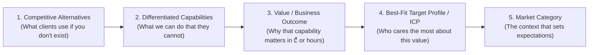

# 🎯 B2B SaaS Positioning & Market Differentiation Skill

Enterprise-grade framework for defining, sharpening, and communicating B2B SaaS product positioning, ideal customer profiles (ICP), and competitive advantages.

---

## 🏛️ Core Positioning Philosophy (April Dunford's 5 Components)

True positioning is NOT clever copywriting or taglines. It is the context that makes your product's value obvious to your best-fit customers.



---

## 🔍 1. Competitive Alternatives Mapping (The Baseline)

Before articulating Artron's value, agents must identify what facility owners are *currently* doing:

| Alternative Category | Reality / Pain Points | Artron's Differentiated Stance |
| :--- | :--- | :--- |
| **Manual Systems (Excel, Paper, Telegram groups)** | Human error, lost revenues, 3+ hours daily on manual attendance & trainer splits, zero fraud prevention. | **100% Automation:** Socket-connected turnstiles, automated ledger & instant report generation. |
| **Legacy On-Premise Software (1C, Old Desktop tools)** | Outdated UI, local database crashes, zero mobile app for athletes, no cloud syncing, zero automated marketing. | **Cloud-Native Dual-Core:** Modern Web Admin + Native Athlete Mobile App in real-time sync. |
| **Generic International SaaS (Mindbody, Glofox)** | Expensive ($200–$500/mo), no Georgian tax/labor compliance (Order №01-15/ნ), no local bank integrations (TBC/BOG), no Georgian turnstile hardware support. | **Hyper-Localized Enterprise Platform:** Full Georgian law compliance, local bank checkout, local IoT hardware protocols. |

---

## 👥 2. Ideal Customer Profile (ICP) Segmentation Matrix

Agents must tailor landing page sections, feature grids, and copy to these 4 distinct ICP segments:

### Segment A: Commercial Fitness Clubs & Gym Chains
- **Primary Buyer:** Gym Owner / General Manager / Operations Director.
- **Top Jobs to Be Done (JTBD):** Eliminate unpaid entries, automate trainer commission calculations, retain expiring memberships.
- **Winning Pitch:** *"გადააქციეთ თქვენი დარბაზი ავტონომიურ შემოსავლის ძრავად: 0 გაპარული ვიზიტი, ტურნიკეტების სრული კონტროლი და +25% დაბრუნებული წევრები AI Win-Back-ით."*

### Segment B: Swimming Pools & Multi-Sport Complexes
- **Primary Buyer:** Facility Director / Chief Accountant.
- **Top Jobs to Be Done (JTBD):** Lane capacity management, medical certificate tracking, automated work-time tables (Order №01-15/ნ).
- **Winning Pitch:** *"აუზებისა და მრავალპროფილური კომპლექსების სრული მართვა: სამედიცინო ცნობების ვადა, ბილიკების დატვირთვა და შრომის ინსპექციისთვის მზა ტაბელი 1 კლიკით."*

### Segment C: Boutique Studios (CrossFit, Yoga, Pilates, Martial Arts)
- **Primary Buyer:** Founder-Trainer / Studio Lead.
- **Top Jobs to Be Done (JTBD):** Group class slot reservations, mobile pass payments, client visit limits.
- **Winning Pitch:** *"დაემშვიდობეთ 'ჩამწერეთ' შეტყობინებებს — ათლეტები თვითონ ირჩევენ დროს მობილური აპლიკაციით, თქვენ კი კონცენტრირდებით ვარჯიშზე."*

### Segment D: Sports Federations & Public Arenas
- **Primary Buyer:** Federation President / Sports Department Lead.
- **Top Jobs to Be Done (JTBD):** Athlete licensing, national rankings, tournament check-in telemetry.
- **Winning Pitch:** *"სპორტსმენთა ეროვნული რეესტრი, ლიცენზირება და შეჯიბრებების ბიომეტრიული აკრედიტაცია ერთიან ეკოსისტემაში."*

---

## 📈 3. Buyer Awareness Stages & Copy Hierarchy

Every page and component must guide the visitor through the 5 Stages of Awareness:

```
Unaware ➔ Problem-Aware ➔ Solution-Aware ➔ Product-Aware ➔ Most Aware
```

1. **Problem-Aware (Hero & Pain Section):** Focus on lost revenue, reception lines, labor audit risks.
2. **Solution-Aware (The New Way):** Introduce Cloud IoT Automation + Integrated Mobile Client ecosystem.
3. **Product-Aware (Dual-Core Showcase & Modules):** Demonstrate Artron Control Panel + Artron Mobile App with concrete feature breakdowns.
4. **Most Aware (Pricing, ROI Calculator & CTA):** Offer risk-free 14-day trial, instant demo scheduling (Google Meet / Zoom / WhatsApp).

---

## 🛑 Rule for Agents
- Never list software features in a vacuum.
- Always link every feature to its **Differentiated Stance** and **Target ICP Value**.
