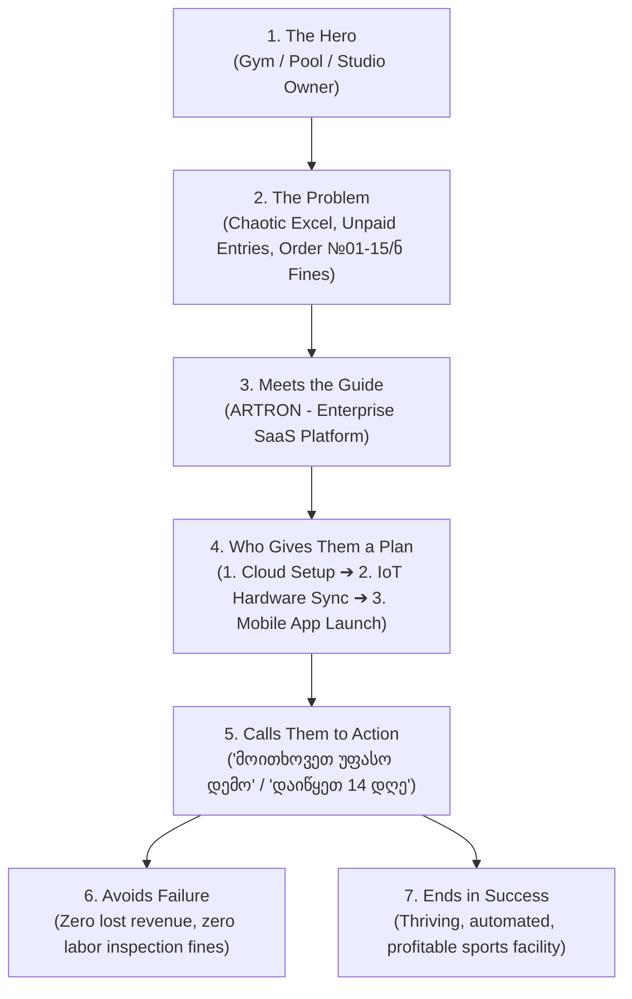

# 💎 Value Proposition Crafting & StoryBrand Framework Skill

World-class framework for converting raw software features into high-converting, emotionally resonant, and ROI-backed value propositions for fitness, wellness, and sports business leaders.

---

## 🎭 1. The StoryBrand 7-Part B2B Narrative

In B2B SaaS, the customer is ALWAYS the Hero; your product is the **Trusted Guide**.

---

## ⚡ 2. The FAB+ROI 4-Step Formula (Mandatory for Feature Cards)

Every feature described on the website or marketing collateral must follow this exact 4-tier chain:

1. **FEATURE (რა არის ტექნიკურად?):** The technical capability (e.g., Raw TCP/Socket Turnstile Controller).
2. **ADVANTAGE (რატომ არის უკეთესი?):** How it outperforms alternatives (e.g., Real-time 50ms pulse, Anti-Passback logic, Dynamic QR code invalidation).
3. **BENEFIT (რა შვებას აძლევს ბიზნესს?):** The operational relief (e.g., Eliminates reception queues and prevents card-sharing between friends).
4. **ROI METRIC (რა ფულს ან დროს უზოგავს?):** Concrete numbers (e.g., *"100%-ით აღმოფხვრილი გაპარული ვიზიტები და -2 საათი ადმინისტრაციული დრო ყოველდღიურად"*).

---

## 📊 3. Ready-to-Use Artron Core Value Matrix (Pains ➔ Value Propositions)

Use these verified value propositions across UI components and landing sections:

### 1. ტურნიკეტები და წვდომის ავტომატიზაცია (IoT Access)
- **Pain:** რეცეფციაში მეგობრის ბარათით შესვლა, გადაუხდელი ვიზიტები, პიკის საათებში რიგები.
- **Hook Headline:** *"დაიცავით თქვენი შემოსავალი: 0 გადაუხდელი შესვლა და 1-წამიანი წვდომა ტურნიკეტზე."*
- **Value Copy:** ჭკვიანი IoT ტურნიკეტები მყისიერად ამოწმებენ აქტიურ აბონემენტს სმარტფონის დინამიური QR კოდით ან RFID-ით. Anti-passback დაცვა გამორიცხავს ერთი ბარათით რამდენიმე პირის შესვლას.

### 2. შრომის დროის აღრიცხვა — ბრძანება №01-15/ნ (Labor Law Compliance)
- **Pain:** შრომის ინსპექციის ჯარიმების შიში, ტაბელის ხელით წერა, ზეგანაკვეთური საათების გაურკვევლობა.
- **Hook Headline:** *"100%-ით დაცული ბიზნესი: შრომის ინსპექციისთვის მზა ტაბელი 1 კლიკით."*
- **Value Copy:** პერსონალისა და მწვრთნელების შემოსვლა-გასვლის მონაცემები ავტომატურად ჯდება ოფიციალურ ტაბელში №01-15/ნ ბრძანების სრული დაცვით. აღარანაირი ხელით ნაწერი რვეულები და საჯარიმო რისკები.

### 3. AI Win-Back & Churn Prediction (წევრების შენარჩუნება)
- **Pain:** აბონემენტის ვადის გასვლის შემდეგ წევრების 30-40% იკარგება; ადმინისტრატორს დრო არ აქვს ყველასთან დასარეკად.
- **Hook Headline:** *"დააბრუნეთ დაკარგული წევრები ავტოპილოტზე: +20% რეაქტივაცია AI-ით."*
- **Value Copy:** სისტემა წინასწარ აფიქსირებს ვარჯიშის სიხშირის კლებას და ვადის ამოწურვამდე უგზავნის პერსონალიზებულ სამოტივაციო შეთავაზებას SMS-ით.

### 4. მწვრთნელების ტაბელი და საკომისიოები (Trainer & Todo Hub)
- **Pain:** მწვრთნელების პროცენტებისა და ინდივიდუალური ვიზიტების თვის ბოლოს ხელით თვლა და კონფლიქტები.
- **Hook Headline:** *"გამჭვირვალე ანგარიშსწორება: მწვრთნელების გაყიდვები და პროცენტები რეალურ დროში."*
- **Value Copy:** ყოველი პერსონალური ვარჯიშის ჩატარება ფიქსირდება მომენტალურად. მწვრთნელიც და მენეჯერიც ხედავენ დარიცხულ ბონუსებს გამჭვირვალედ.

---

## 🎯 4. CTA (Call-to-Action) High-Conversion Formulas

Avoid weak, generic CTAs like *"გაგზავნა"* or *"დაგვიკავშირდით"*. Always use **Value-Packed, Risk-Free Action CTAs**:

- **Primary B2B CTA:** `"მოითხოვეთ პერსონალური დემო"` / `"დაიწყეთ 14 დღე უფასოდ"`
- **Direct Messaging CTA:** `"დაგვიკავშირდით WhatsApp-ში"` / `"დაგვიკავშირდით Telegram-ში"`
- **Micro-copy under CTA:** `"💳 საკრედიტო ბარათი არ არის საჭირო • ⏱️ ინსტალაცია 24 საათში • 🔒 GDPR & კანონმდებლობასთან სრული შესაბამისობა"`

---

## 🛑 Rule for Agents
- Always check that every heading and subtitle contains a **Clear Business Benefit**, not just an engineering description.
