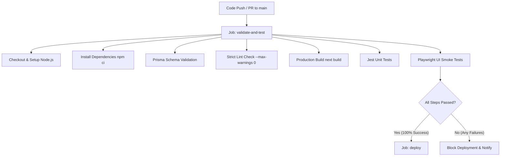

# ARTRON Automated CI/CD Pipeline & Quality Gate Guide

This guide describes the automated CI/CD pipeline and the quality gates implemented for the Artron web landing platform. The setup ensures that every commit and pull request targeting the `main` branch is strictly verified, type-checked, tested, and audited before deployment.

---

## 🛠️ Pipeline Architecture & Stages

The CI/CD pipeline is configured in [.github/workflows/artron-ci-cd.yml](file:///Users/davittodua/Documents/lending/.github/workflows/artron-ci-cd.yml) and consists of two primary jobs:



### 1. The `validate-and-test` Job
This job runs on every push and pull request to `main` branch. It executes the following strict checks:
- **Dependency Installation**: Uses `npm ci` to install clean, exact versions from `package-lock.json`.
- **Database Schema Validation**: Runs `npx prisma validate` to confirm the database schema's syntactic correctness without requiring a live database connection.
- **Strict Lint Gate**: Runs `npm run lint -- --max-warnings 0` which treats any lint warning as a failure, blocking downstream jobs.
- **Type Checking & Production Build**: Runs `npm run build` to run TypeScript compiler validation and generate production build assets.
- **Jest Unit Tests**: Executes unit tests in the `tests/unit/` directory.
- **Playwright UI Smoke Tests**: Bootstraps the local server and runs headless E2E/UI checks in the `tests/e2e/` directory.

### 2. The `deploy` Job (Quality Gate Keeper)
- **Trigger**: Runs only after the `validate-and-test` job completes successfully.
- **Constraint**: Restricts run to pushing to the `main` branch. Pull requests or failed test runs will NEVER trigger deployment.
- **Execution**: Automates triggering the release to production servers (Vercel / Docker registry).

---

## 🍪 Google Consent Mode v2 Verification

The E2E test suite actively verifies the integrity of the cookie and consent framework. In accordance with the **Artron Cookie & Consent Policy**, the system verifies that:

1. **Default State is Denied**: Before user interaction, all analytics and marketing consent scopes default to `denied` (e.g. `analytics_storage: 'denied'`, `ad_storage: 'denied'`). No marketing tags or analytics tracking are loaded.
2. **Audit Trail Logging**: When a user selects their preferences (Accept All, Decline All, or custom configuration), an immutable log entry is generated and appended to the local storage audit trail (`artron_consent_logs` table).
3. **State Transition**: E2E smoke tests ([consent-mode.test.ts](file:///Users/davittodua/Documents/lending/tests/e2e/consent-mode.test.ts)) simulate browser interactions (clicking Accept All, Decline All, or using the custom settings panel) and assert that the localStorage `artron_cookie_consent` preferences and `artron_consent_logs` reflect the selections precisely.

---

## 🚀 Running Tests Locally

Before pushing changes to the repository, developers should verify their updates locally using the following commands:

### Running Unit Tests
```bash
npm run test
```

### Running UI Smoke Tests
To run Playwright tests locally (ensure the browsers are installed first with `npx playwright install`):
```bash
npm run test:e2e
```

### Enforcing Strict Linting
```bash
npm run lint -- --max-warnings 0
```
